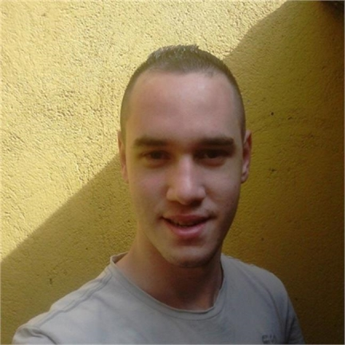

# CRUD - Cadastro de Pessoas (Infra) :file_folder:
:bookmark_tabs: **Mostrando um pouco do CRUD de Cadastro de pessoas feito pela Equipe de Infra, com deploy no Azure**

:heavy_exclamation_mark: **Este conteúdo faz parte de um cronograma educacional, e foi uma tarefa solicitada para todos os alunos da Turma 2/3DM do Senai Suiço-Brasileira**

## :information_source: Especificações do Projeto:

**Neste projeto utilizamos o Node.js, MySQL e o Azure com o Debian 10 "Buster" para realizarmos um CRUD, dividindo as partes do trabalho em Front-End, Back-End, Banco de Dados e Máquina Virtual. A ideia deste CRUD é simularmos uma Loja de Informática, onde são registrados os produtos, que no nosso caso possuem, código, nome, valor e descrição do produto.**

## 📌 Recursos usados neste projeto:

</img> **Visual Studio Code -  (https://code.visualstudio.com/Download)**

</img> **NodeJS - (https://nodejs.org/en/)**

</img> **Microsoft Azure -  (https://azure.microsoft.com/pt-br/)**

## :information_source: **Acesse nossa demo no Azure --> (http://crud-informatica.eastus.cloudapp.azure.com:3000)**

## :information_source: **Comandos importantes:**
### 📍 **Instala as dependências**
**sudo npm install (Linux)**  
**npm install**

### 📍 **Inicia um projeto**
**sudo npm init (Linux)**  
**npm init**

### 📍 **Roda o projeto**
**npm start**  
**sudo ./node_modules/.bin/nodemon app.js & (Linux)**

## Membros da Equipe de Infra :beginner:

**</img> - Caliu Magalhães |**

**</img> - João Augusto |**

**</img> - Jorge Gonzaga |**

**</img> - Luiz Alberto |**

**</img> - Rosana Araújo**

**</img> - Vitor Geovani |**

